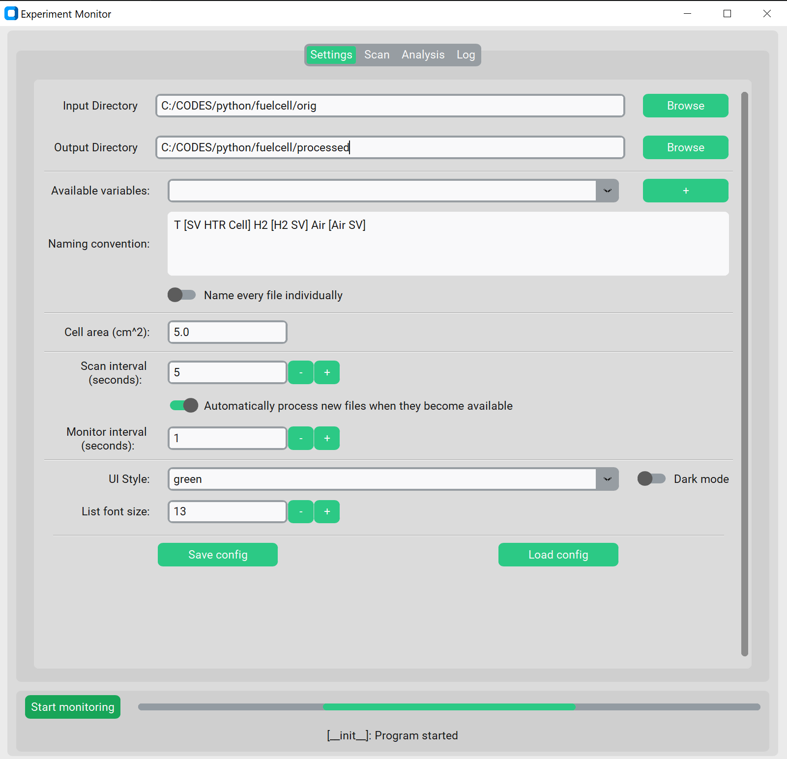
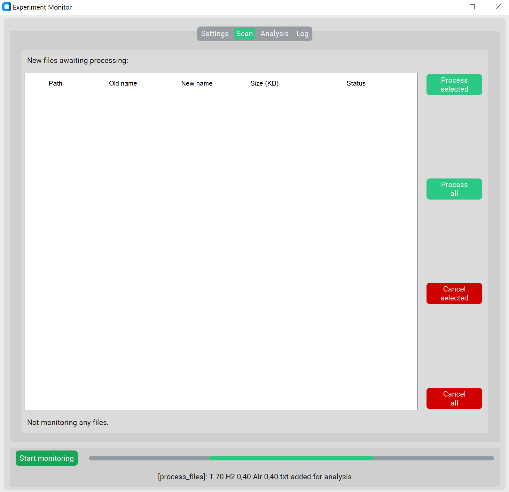
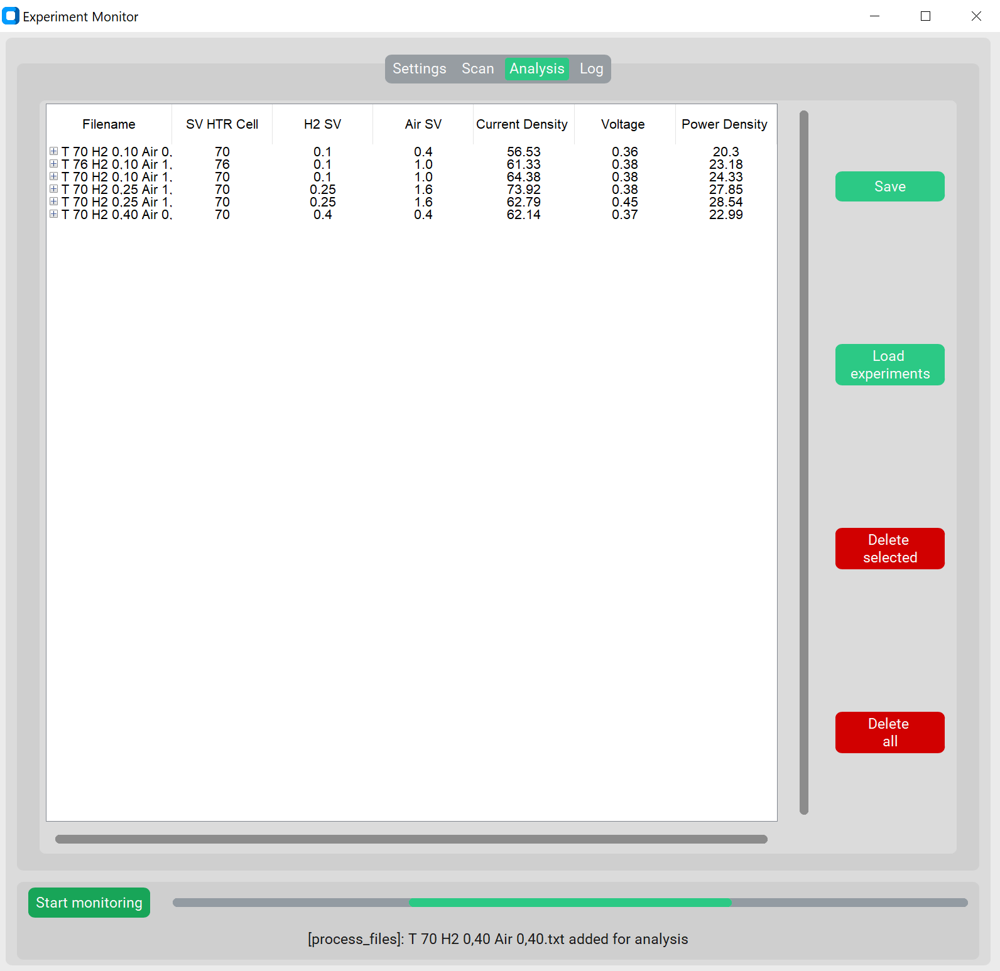

# Experiment Monitor — PEM Fuel Cell Test Monitoring Tool

A desktop application for real-time monitoring and analysis of PEM fuel cell experiments. Developed during PhD research at Eskişehir Technical University as a productivity tool for researchers running multi-experiment test sessions.

---

## What It Does

Running multiple fuel cell experiments in a single session means constantly switching between the test station software and a spreadsheet to track results. **Experiment Monitor** eliminates that bottleneck.

The application watches a directory where the test station saves its output files. As each experiment completes, the file is automatically detected, parsed, renamed according to a user-defined naming convention, and added to the analysis table — all without any manual input. At a glance, the researcher can see whether each experiment performed well or poorly based on peak current density, voltage, and power density.

When the session is over, all results can be exported to a clean, formatted Excel file with a single click.

---

## Features

- **Real-time file monitoring** — Automatically detects new experiment output files as they are saved by the test station
- **Automatic analysis** — Extracts peak current density, voltage, and power density from each experiment upon detection
- **Configurable naming convention** — Define how output files should be renamed using experimental variables (temperature, H₂ space velocity, air space velocity, etc.)
- **Session overview table** — All experiments from the current session displayed side by side for instant comparison
- **Excel export** — Batch export all results to a formatted `.xlsx` file
- **Load previous sessions** — Import and review results from earlier experiment sets
- **Customizable UI** — Multiple color themes and dark/light mode toggle
- **Persistent configuration** — Settings saved and reloaded between sessions

---

## Screenshots

### Settings Tab
Configure input/output directories, naming convention, cell area, scan interval, and UI preferences.



### Scan Tab
New experiment files awaiting processing appear here automatically. Files can also be processed manually.



### Analysis Tab
Processed experiments are listed with their extracted parameters. Rows can be expanded, deleted, or exported.



---

## Installation

### Run from source

**Requirements:** Python 3.10+

```bash
git clone https://github.com/tolgakanatli/fuel_cell_monitor.git
cd fuel_cell_monitor
pip install -r requirements.txt
python main.pyw
```

### Dependencies

| Package | Version | Purpose |
|---|---|---|
| customtkinter | 5.2.2 | GUI framework |
| pandas | 2.2.2 | Data processing |
| openpyxl | 3.1.5 | Excel export |
| pyinstaller | 6.11.1 | Executable packaging |

### Build standalone executable (Windows)

```bash
pyinstaller main.spec
```

---

## Usage

1. **Settings tab:** Set the input directory (where the test station saves files) and the output directory. Define the naming convention using available variables (e.g. `T [SV HTR Cell] H2 [H2 SV] Air [Air SV]`). Enter the cell active area in cm².
2. **Start monitoring:** Click *Start monitoring*. The application will scan for new files at the configured interval.
3. **Scan tab:** New files appear here as they are detected. Processing happens automatically if the toggle is enabled, or manually via *Process selected* / *Process all*.
4. **Analysis tab:** Completed experiments appear in the table with their peak performance metrics. Use *Save* to export all results to Excel.

---

## Project Structure

```
fuel_cell_monitor/
├── main.pyw            # Application entry point
├── main.spec           # PyInstaller build configuration
├── requirements.txt
├── functions/          # Core logic (file scanning, parsing, data processing)
├── gui/                # UI components and tab definitions
└── resources/          # Icons, assets, configuration defaults
```

---

## Background

This tool was developed to support experimental work on PEM fuel cell cathode catalyst development. During test campaigns involving dozens of experiments across varied temperature and gas flow conditions, manually tracking results between the test station software and a spreadsheet introduced errors and slowed down decision-making. Experiment Monitor was built to automate that workflow.

The application is written in Python and designed to be cross-platform, with the exception of one file-locking check that relies on Windows behavior (attempting a rename to detect whether a file is still being written).

---

## Author

**Dr. Tolga Kaan Kanatlı**  
PhD in Chemical Engineering — PEM Fuel Cells & Hydrogen Production  
[GitHub](https://github.com/tolgakanatli) · [LinkedIn](https://linkedin.com/in/tolgakanatli) · tolgakanatli@hotmail.com

---

## License

MIT License
